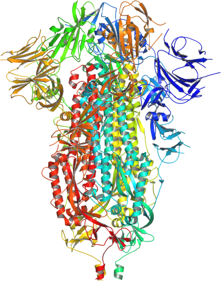

# COVID-19 The Deadliest Disease In American History

This repository contains the COVID19 NFT in high-resolution PDF format, along with a document with the technical specifications associated with it. The NFT is zipped and password protected. **Password is in the locked section of the NFT page on OpenSea.** 

* Click on the zip files listed above, which will lead to a different page with the download button.
* Zip files are created by PeaZip (https://peazip.github.io/), a cross-platform, free and open-source software.
* NFT file is around 158 MB in size which is split into two zip files (COVID19-NFT.zip.001 and COVID19-NFT.zip.002). Open the first file in PeaZip and extract it using the password. It will put together the zip splits and produce a single PDF document.

*Note: I have not tested other zip/archiving software; however, given zip is a standard format, these archives should be able to extract using other commonly used software.*

For more information and help please contact Rohit Farmer at [rohit.farmer@gmail.com](mailto:rohit.farmer@gmail.com)

## NFT Description
In September 2021, COVID19 surpassed the death toll of 675,000 of the 1918 Spanish flu pandemic in the USA - becoming the deadliest disease in American history. COVID-19 is caused by a coronavirus called SARS-CoV-2. Spike protein (S) on the surface of the SARS-CoV-2 virus binds to human cells by recognizing the ACE2 protein receptor. This binding facilitates the fusion of the virus to human cells leading to the injection of the viral genetic material into the human cells. Once inside the human cells, viral genetic material utilizes host machinery to produce more copies of the SARS-CoV-2 virus.

This single copy of NFT (24 X 36-inch poster) commemorates the record-breaking deaths in the USA by rendering the spike protein in 675,001 unique combinations of RGB (red, green, and blue) color codes. These 675,001 colors are randomly sampled from all the possible (16,777,216) computer-generated colors. It’s a work of several weeks of computation that involved generating hex codes from all the possible combinations of RGB values, rendering individual spike protein structures into unique colors, stitching individual images into rows to cover the width of the poster, and then stacking rows to cover the height of the poster. All the steps were carried out programmatically in the R programming language.

Structure of the SARS-CoV-2 spike protein in its closed state rendered in cartoon drawing
and colored according to protein chain subunits.

## References
1. [COVID Has Killed More Americans Than the Spanish Flu Did in 1918](https://www.usnews.com/news/health-news/articles/2021-09-21/covid-has-killed-more-americans-than-the-spanish-flu-did-in-1918)  
2. [COVID-19 Has Now Killed About As Many Americans As The 1918-19 Flu](https://www.npr.org/sections/coronavirus-live-updates/2021/09/20/1039071274/covid-19-deaths-1918-19-flu-pandemic)  
3. [RCSB: COVID-19/SARS-CoV-2 Resources](https://rcsb.org/covid19)
4. [Structure, Function, and Antigenicity of the SARS-CoV-2 Spike Glycoprotein](https://www.sciencedirect.com/science/article/pii/S0092867420302622)